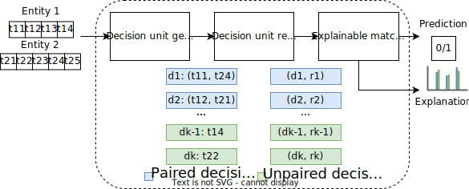
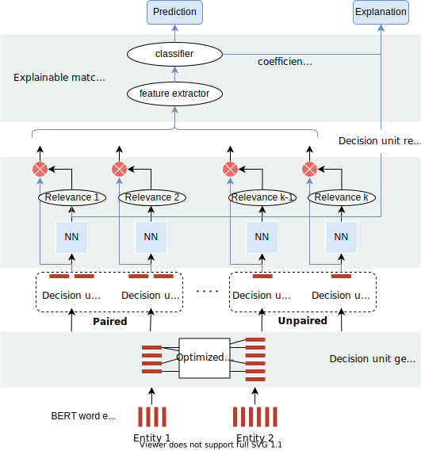

WYM
===

Explainable classification systems generate predictions along with a
weight for each term in the input record measuring its contribution to
the prediction. In the entity matching (EM) scenario, inputs are pairs
of entity descriptions and the resulting explanations can be difficult
to understand for the users. They can be very long and assign different
impacts to similar terms located in different descriptions.

We introduce the concept of decision units, basic information units formed either by pairs of (similar) terms, each one belonging to a different entity description, or unique terms, existing in one of the descriptions only.
^^^^^^^^^^^^^^^^^^^^^^^^^^^^^^^^^^^^^^^^^^^^^^^^^^^^^^^^^^^^^^^^^^^^^^^^^^^^^^^^^^^^^^^^^^^^^^^^^^^^^^^^^^^^^^^^^^^^^^^^^^^^^^^^^^^^^^^^^^^^^^^^^^^^^^^^^^^^^^^^^^^^^^^^^^^^^^^^^^^^^^^^^^^^^^^^^^^^^^^^^^^^^^^^^^^^^^^^^^^^^^^

Decision units form a new feature space, able to represent, in a compact and meaningful way, pairs of entity descriptions.
^^^^^^^^^^^^^^^^^^^^^^^^^^^^^^^^^^^^^^^^^^^^^^^^^^^^^^^^^^^^^^^^^^^^^^^^^^^^^^^^^^^^^^^^^^^^^^^^^^^^^^^^^^^^^^^^^^^^^^^^^^

An explainable model trained on such features generates effective explanations customized for EM datasets.
^^^^^^^^^^^^^^^^^^^^^^^^^^^^^^^^^^^^^^^^^^^^^^^^^^^^^^^^^^^^^^^^^^^^^^^^^^^^^^^^^^^^^^^^^^^^^^^^^^^^^^^^^^

In this paper, we propose this idea via a three-component architecture
template, which consists of a decision unit generator, a decision unit
scorer, and an explainable matcher.

WYM Logic Architecture
~~~~~~~~~~~~~~~~~~~~~~

   WYM Logic Architecture\`

We introduce WYM (Why do You Match?), an implementation of the architecture oriented to textual EM databases.
^^^^^^^^^^^^^^^^^^^^^^^^^^^^^^^^^^^^^^^^^^^^^^^^^^^^^^^^^^^^^^^^^^^^^^^^^^^^^^^^^^^^^^^^^^^^^^^^^^^^^^^^^^^^^

The experiments show that our approach has accuracy comparable to other
state-of-the-art Deep Learning based EM models, but, differently from
them, its prediction are highly interpretable.

WYM full architecture
~~~~~~~~~~~~~~~~~~~~~

   WYM flow\`
